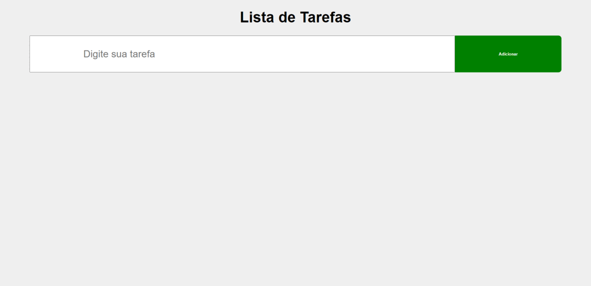

# Lista de tarefas
Lista de Tarefas simples feita com HTML, CSS e JavaScript

Esse é o meu primeiro projeto utilizando JavaScript. Ele tem o objetivo de ser simples e funcional.

As tarefas são adicionadas e, quando marcadas, vão para o fim da lista. Também podem ser deletadas utilizando o botão Deletar.

 

Por meio do link abaixo, você pode acessar a página postada:

<a target="_blank" href="https://gabrielarib.github.io/listadetarefas/">Link</a>
 

